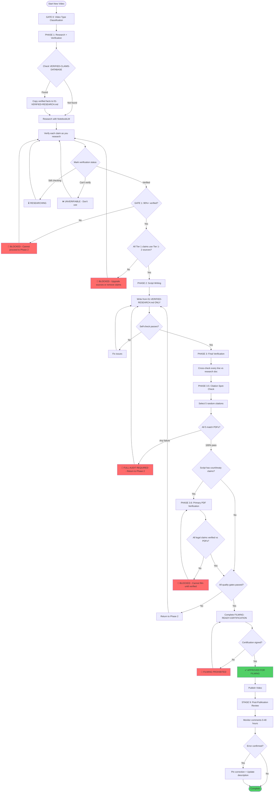

# History vs Hype - Master Workflow

**Single source of truth for video production.**

**Core Principle:** Verify facts BEFORE writing, not after. This prevents errors and saves 3+ hours per video.

---

## Quick Reference: Commands

| Stage | Command | Purpose |
|-------|---------|---------|
| 1. Topic | `/find-topic` | Research trends + VidIQ validation |
| 2. Research | `/deep-research` | Preliminary research (free sources) |
| 3. Sources | `/suggest-sources` | Recommend books for NotebookLM |
| 4. Prompts | `/notebooklm-prompts` | Generate NotebookLM research prompts |
| 5. Script | `/script` | Generate script from verified research |
| 6. Review | `/review-script` | Structure + voice + retention check |
| 7. Fact-Check | `/fact-check` | Final verification before filming |
| 8. Publish | `/youtube-metadata` | Title, description, tags |

**Full workflow:** `/new-video` guides you through all stages.

---

## The 3-Phase Verified Workflow

### Why This Matters

**Old way (caused errors):**
```
Research → Write script → Fact-check → Find errors → Rewrite → Re-check
Time: 9 hours | Errors: 2 major
```

**New way (error-free):**
```
Research + Verify simultaneously → Write from verified facts → Cross-check
Time: 5.5 hours | Errors: 0
```

### Workflow Visualization



**Key Decision Points:**
- 🚫 **Red blocks** = Hard stops where filming is prohibited
- ⏳ **Yellow states** = Still researching, not verified yet
- ✅ **Green states** = Approved to proceed

---

## GATE 0: Video Type Classification (BEFORE Research)

**Classify video type before starting research. This determines which quality gates apply.**

| Type | Description | Gates Required |
|------|-------------|----------------|
| **TERRITORIAL** | Border disputes, sovereignty claims, geographic anomalies | Map Framing + Kraut Depth + Thesis Advancement |
| **IDEOLOGICAL** | Myth-busting, "everyone believes X" narratives | Kraut Depth + Thesis Advancement |
| **PERSON-CENTERED** | Fact-checking individual's claims | Claim-Rebuttal + Steelman + Thesis Advancement |
| **LEGAL/PROCESS** | Explaining mechanisms (ICJ, treaties, legal procedures) | Mechanism Explanation + Kraut Depth + Thesis Advancement |

**Record in PROJECT-STATUS.md:**
```markdown
**Video Type:** [TERRITORIAL / IDEOLOGICAL / PERSON-CENTERED / LEGAL]
**Gates Required:** [List from table above]
```

**Decision Guide:**
- Does video center on a geographic anomaly or border? → TERRITORIAL
- Does video debunk a widely-held belief? → IDEOLOGICAL
- Does video fact-check a specific person's claims? → PERSON-CENTERED
- Does video explain how a legal/administrative process works? → LEGAL/PROCESS

---

## PHASE 1: Research + Verification

**File:** `01-VERIFIED-RESEARCH.md` (single source of truth)

---

### STEP 0: Check Verified Claims Database (MANDATORY)

**Before researching common claims, check if they're already verified:**

**File:** `.claude/VERIFIED-CLAIMS-DATABASE.md`

**Common reusable facts across videos:**
- Literacy rates (Roman vs Medieval)
- Colonial treaty dates and provisions
- ICJ precedent rulings
- Standard geography measurements (Earth circumference, etc.)
- Frequently cited primary sources (Isidore, Sacrobosco, etc.)

**Process:**
1. Open `.claude/VERIFIED-CLAIMS-DATABASE.md`
2. Search for your topic keywords (Ctrl+F)
3. If claim exists with ✅ VERIFIED status:
   - Copy verified fact to your `01-VERIFIED-RESEARCH.md`
   - Include sources already cited
   - Mark as ✅ VERIFIED (no need to re-research)
4. If claim doesn't exist or needs updating:
   - Proceed with research as normal
   - After verification, add to database for future videos

**Why this matters:** Saves 2-4 hours per video by avoiding re-research of common facts.

**Example:**
- Video 1 researches "Eratosthenes calculated Earth circumference 240 BC" → Verifies with 2 sources → Adds to database
- Video 2 needs same fact → Finds it in database → Uses immediately without re-research

---

**As you research, immediately verify each fact:**

### Status Markers
- ✅ VERIFIED - Ready to use in script
- ⏳ RESEARCHING - Still checking sources
- ❌ UNVERIFIABLE - Don't use

### Source Priority (2010-Present Preferred)
- **Primary sources:** Timeless (treaties, documents, archives)
- **Secondary scholarship:** Prioritize 2010-present
- **Pre-2010 classics:** Note as "foundational" and check for updates

### Required Sections

```markdown
## SECTION: [Topic Category]

### ✅ CLAIM: [Description]
**What's claimed:** [Statement]
**What's true:** [Verified fact]
**Sources:**
1. [Author] (Year) - *Title*, p. XX
2. [Author] (Year) - *Title*, p. XX

**Primary Source Quote (EXACT):**
> "[Word-for-word quote]"
> — [Source, date]

**Script-Ready:** ✅ YES
```

### STEELMAN Section (Mandatory)

Before writing script, document:
- **Opposing position:** What does the other side argue?
- **Their strongest evidence:** Best points they make
- **What they get RIGHT:** Acknowledge valid points
- **Script approach:** How to present fairly before rebutting

### Quality Gate: 90% Rule

**Cannot proceed to script writing until:**
- [ ] 90%+ claims verified with 2+ sources
- [ ] All major quotes word-for-word exact
- [ ] All numbers have sources
- [ ] Steelman section complete

---

## PHASE 2: Script Writing

**File:** `02-SCRIPT-DRAFT.md`

**Rule:** ONLY use facts from `01-VERIFIED-RESEARCH.md`

If you need an unverified fact → **STOP** → Go verify it first

### Script Structure (Proven Formula)

**HOOK (0:00-0:15)** [~60 words]
- Modern consequence first
- Specific date/figure
- Stakes clear

**TENSION (0:15-0:45)** [~100 words]
- The claim being made
- Who believes it
- "But when I checked the documents..."

**FIRST PAYOFF (0:45-1:15)** [~120 words]
- Show primary evidence
- State contradiction clearly
- Prevents 1:11 drop-off

**EVIDENCE SECTIONS (1:15-7:00)**
- Primary source quotes with citations
- Deep causal chains (consequently, thereby, which meant that)
- Modern relevance every 90 seconds
- Pattern interrupt every 2-3 minutes

**SYNTHESIS (7:00-9:00)**
- Acknowledge complexity
- Counter-evidence presented
- Why simple narrative persists

**CTA (9:00-End)**
- Why accurate history matters
- Sources in description
- Subscribe

### The "Spreadsheet Angle" (Subscriber Growth)

Your audience subscribes for mechanisms, not narratives:

| Focus On | Not On |
|----------|--------|
| "What Article 3 says" | "Why they signed" |
| "The exact coordinates" | "The conflict" |
| "The legal mechanism" | "The politics" |

### Self-Check Before Review

- [ ] Every fact references VERIFIED-RESEARCH.md
- [ ] All quotes exact word-for-word
- [ ] All numbers match verified table
- [ ] Read aloud - natural delivery
- [ ] Filler count within budget

---

## PHASE 3: Final Verification

**File:** `03-FACT-CHECK-VERIFICATION.md`

**Cross-check every claim against VERIFIED-RESEARCH.md**

```markdown
### Line [X]: [Claim Type]
**Script says:** "[Quote from script]"
**Research doc says:** [Reference] - EXACT MATCH ✅
**Status:** ✅ VERIFIED
```

### Verification Summary

**Total claims:** X
**Cross-checked:** X/X (100%)
**Errors found:** 0

**VERDICT:** ✅ APPROVED FOR FILMING

---

## PHASE 3.5: MANDATORY CITATION SPOT-CHECK

**BLOCKING REQUIREMENT - Cannot film until complete**

### Random Citation Verification

Select 5 citations at random from the script that include page numbers.

**Selection method:**
- Use random number generator on total script lines
- Select citations containing: author name + book title + page number
- Exclude citations without page numbers (these go to separate verification)

### Verification Process

For each selected citation:

**Step 1: Locate Source**
- [ ] PDF/book file confirmed in possession
- [ ] File name: _______________
- [ ] Accessible: YES / NO

**Step 2: Verify Page Number**
- [ ] Navigate to cited page number
- [ ] Quote appears on page: YES / NO / PARTIAL
- [ ] Page number accurate: YES / NO (if NO, correct page: ___)

**Step 3: Verify Quote Accuracy**
- [ ] Quote is word-for-word: YES / NO
- [ ] Context supports claim: YES / NO
- [ ] Screenshot saved: YES / NO
- [ ] Screenshot filename: _______________

**Step 4: Document Results**

```
CITATION SPOT-CHECK RESULTS
Date: [YYYY-MM-DD]
Verifier: [Name]

Citation 1 (Line ___): [Author, page ___]
✅ VERIFIED / ❌ FAILED
Issues: _______________

Citation 2 (Line ___): [Author, page ___]
✅ VERIFIED / ❌ FAILED
Issues: _______________

Citation 3 (Line ___): [Author, page ___]
✅ VERIFIED / ❌ FAILED
Issues: _______________

Citation 4 (Line ___): [Author, page ___]
✅ VERIFIED / ❌ FAILED
Issues: _______________

Citation 5 (Line ___): [Author, page ___]
✅ VERIFIED / ❌ FAILED
Issues: _______________
```

### Failure Protocol

**If ANY citation fails verification:**

1. **FULL AUDIT REQUIRED**
   - Review ALL citations from the failed source
   - Do not proceed to filming
   - Return script to Phase 2 for correction

2. **Document Failure**
   - Add to `03-FACT-CHECK-VERIFICATION.md`:
     ```
     ⚠️ CITATION AUDIT TRIGGERED
     Failed citation: [details]
     Action taken: [full review / source removal / correction]
     Re-verified: [date]
     ```

3. **Re-run Spot-Check**
   - After corrections, select 5 NEW random citations
   - Repeat verification process
   - Cannot proceed until all pass

### Verification Evidence

**Required files:**
- `assets/verification/citation-spotcheck-[date].md` (results log)
- `assets/verification/screenshots/` (5 page screenshots minimum)

**Save location:** `video-projects/[project]/assets/verification/`

### Filming Gate

**FILMING IS BLOCKED UNTIL:**
- [ ] 5 random citations verified (100% pass rate)
- [ ] Results logged with date and verifier name
- [ ] Screenshots saved to verification folder
- [ ] No failed citations requiring full audit

**Status:** ❌ NOT COMPLETE / ✅ VERIFIED [Date]

---

## PHASE 3.6: PRIMARY PDF VERIFICATION (Legal/Treaty Claims)

**BLOCKING REQUIREMENT - Applies to videos containing:**
- Court rulings (ICJ, Supreme Court, any judicial decision)
- Treaty provisions (specific articles, clauses, obligations)
- Legal definitions (jurisdiction, material breach, estoppel, sovereignty)
- Jurisdictional status claims (which court has authority, what law applies)

**If script contains NONE of the above:** Skip to Phase 3.7

**If script contains ANY of the above:** Complete this verification

---

### Identification Phase

Scan script for legal/treaty claims. Mark each with line number.

**Court Ruling Claims:**
- [ ] Line ___ : Court ruled that [claim]
- [ ] Line ___ : Judgment stated [claim]
- [ ] Line ___ : Court found [claim]

**Treaty Provision Claims:**
- [ ] Line ___ : Treaty requires/says/establishes [claim]
- [ ] Line ___ : Article [X] provides [claim]
- [ ] Line ___ : Agreement stipulates [claim]

**Legal Definition Claims:**
- [ ] Line ___ : [Legal term] means [definition]
- [ ] Line ___ : Under international law, [claim]
- [ ] Line ___ : The legal standard is [claim]

**Jurisdictional Claims:**
- [ ] Line ___ : [Court/Body] has jurisdiction over [claim]
- [ ] Line ___ : [Law/Convention] applies to [claim]

**Total claims requiring verification:** ___

---

### PDF Verification Process

For EACH identified claim:

**Step 1: Obtain Primary Source**
- [ ] Downloaded: Court ruling PDF / Treaty official text
- [ ] Source: [UN Treaty Series / ICJ website / National archive]
- [ ] Filename: _______________
- [ ] Date of document: _______________

**Step 2: Locate Exact Language**
- [ ] Search PDF for relevant section
- [ ] Paragraph number: ___
- [ ] Page number: ___
- [ ] Section/Article number: ___

**Step 3: Verify Claim Against Source**

**Script Claim (Line ___):**
"_______________________________________________"

**Actual Text from PDF:**
"_______________________________________________"

**Verification:**
- [ ] Claim matches source: EXACT / PARAPHRASE / MISCHARACTERIZED / WRONG
- [ ] Context supports script usage: YES / NO
- [ ] Nuance preserved: YES / NO / NOT APPLICABLE

**If MISCHARACTERIZED or WRONG:**
- Return script to Phase 2
- Correct claim
- Re-verify against PDF
- Log correction

**Step 4: Screenshot Evidence**
- [ ] Screenshot of relevant PDF paragraph
- [ ] Filename: `[source-name]-p[page]-para[number].png`
- [ ] Saved to: `assets/verification/primary-sources/`

---

### Verification Log Template

Create file: `video-projects/[project]/PRIMARY-PDF-VERIFICATION.md`

```markdown
# Primary PDF Verification Log

**Video:** [project name]
**Date:** [YYYY-MM-DD]
**Verifier:** [Name]

---

## CLAIM 1

**Script Line:** [Line number]
**Script Claim:** "[Exact text from script]"

**Primary Source:**
- Document: [Full title]
- Date: [YYYY-MM-DD]
- Source URL: [Official source]
- File: [Filename in project folder]

**Verification:**
- Location: Page ___, Paragraph ___
- Actual Text: "[Word-for-word from PDF]"
- Assessment: ✅ ACCURATE / ⚠️ PARAPHRASE / ❌ MISCHARACTERIZED

**Evidence:** `assets/verification/primary-sources/[filename].png`

**Action Taken:** APPROVED / CORRECTED / REMOVED

---

## CLAIM 2

[Repeat format]

---

## VERIFICATION SUMMARY

**Total Claims Verified:** ___
**Accurate:** ___
**Corrected:** ___
**Removed:** ___

**Status:** ✅ ALL VERIFIED / ❌ CORRECTIONS REQUIRED

**Filming Approval:** ❌ BLOCKED / ✅ APPROVED [Date]
```

---

### Filming Gate

**FILMING IS BLOCKED UNTIL:**
- [ ] All court rulings verified against actual judgment PDFs
- [ ] All treaty provisions verified against official treaty text
- [ ] All legal definitions sourced to authoritative document
- [ ] All jurisdictional claims verified against relevant law/convention
- [ ] PRIMARY-PDF-VERIFICATION.md completed and signed
- [ ] Screenshot evidence saved for each claim

**If NO legal/treaty claims in script:**
- [ ] Confirmed: Script contains no court rulings, treaties, or legal definitions
- [ ] Skip Primary PDF Verification
- [ ] Proceed to next gate

**Status:** ❌ NOT COMPLETE / ✅ VERIFIED [Date] / ⏭️ NOT APPLICABLE

---

## Extended Workflow: Topic to Publishing

### Stage 1: Topic Selection (2-3 hours)

**Command:** `/find-topic`

**VidIQ Coach Prompt:**
```
I debunk historical propaganda using primary sources displayed on screen.

MY CRITERIA:
✅ Primary sources I can show
✅ Real-world harm TODAY
✅ Evidence-based debunking
✅ Educated 25-44 audience

What HISTORICAL propaganda has:
- 5,000+ monthly searches
- Competition under 45
- Clear primary sources
- Documented modern harm
```

**Topic Types That Work:**

| Type | Performance | Example |
|------|-------------|---------|
| Territorial Disputes | 12x baseline | Venezuela-Guyana |
| Politician Fact-Checks | 11% CTR | JD Vance myths |
| Colonial Border Myths | 4x baseline | Sykes-Picot |

### Stage 2: Preliminary Research (4-8 hours)

**Command:** `/deep-research [topic]`

**Uses free sources only:**
- Wikipedia (timeline)
- Archives (.gov, .edu)
- Google Scholar (previews)
- News (modern relevance)

**Output:** Preliminary findings, source list, verdict (YES/MAYBE/NO)

---

### Stage 2.5: Competitor Analysis & Differentiation (NEW - 1-2 hours)

**Purpose:** Ensure your video offers something competitors don't.

**Step 1: Download Competitor Transcripts**
```bash
yt-dlp --write-auto-sub --sub-lang en --skip-download -o "[output-name]" "[YouTube URL]"
```

Find 3-5 existing videos on your topic (search: `ytsearch5:[topic]`)

**Step 2: Analyze What's Overdone**

| Element | Competitor Coverage | Our Angle |
|---------|---------------------|-----------|
| Main narrative | What do ALL videos say? | What do NONE say? |
| Evidence used | What sources do they cite? | What primary sources can we SHOW? |
| Framing | One-sided advocacy? Both extremes? | Both-extremes steelman |
| Modern hook | Which news hooks are stale? | What's fresh? |

**Step 3: Find International Comparison**
- What parallel case from another country illustrates the same principle?
- "Unlike [Country A]..." pattern opportunity
- Example: Haiti debt → Compare to British compensation for slaveholders

**Step 4: Identify Data Comparison Hook Opportunity**
- What two data points can be contrasted in opening?
- Same geography/time, different outcomes
- Specific numbers that tell the story

**Differentiation Checklist (Cannot Proceed Without):**
- [ ] Identified ≥1 angle NO competitor covers
- [ ] Identified ≥1 international comparison opportunity
- [ ] Confirmed document-on-screen methodology not used by competitors
- [ ] Found data comparison hook possibility

**Output:** Add to `01-VERIFIED-RESEARCH.md`:
```markdown
## COMPETITOR DIFFERENTIATION ANALYSIS

### Videos Analyzed:
1. [Title] - [Channel] - [URL]
2. [Title] - [Channel] - [URL]

### Common Angles (Overdone):
- [What everyone says]

### Missing Angles (Our Opportunity):
- [What NO ONE says that we can cover]

### International Comparison:
- [Country/case we'll compare to]

### Data Comparison Hook:
- [Two data points for opening]
```

---

### Stage 3: NotebookLM Verification (8-12 hours)

**Command:** `/suggest-sources` then `/notebooklm-prompts`

**NotebookLM Limits:**
- Max 50 sources per notebook
- 25M words total
- Supports PDFs, Docs, web pages

**Source Upload Order:**
1. **Tier 1:** Primary documents (treaties, archives)
2. **Tier 2:** Academic books (peer-reviewed)
3. **Tier 3:** Respected journalism, reports

**Key Research Prompts:**
1. Evidence extraction with page numbers
2. Modern connections (2024-2025)
3. Counter-evidence check (steelman)

### Stage 4: Script Generation (2-4 hours)

**Command:** `/script`

See Phase 2 above.

### Stage 5: Review & Fact-Check (2-3 hours)

**Commands:** `/review-script` then `/fact-check`

**Review checks:**
- Structure (both extremes, modern hooks)
- Voice (natural fillers, conversational)
- Retention (pattern interrupts, dead zones)

### Stage 6: B-Roll Gathering (4-8 hours)

**Command:** `/edit-guide` or `/zero-budget-assets`

**Priority:**
- 🔴 CRITICAL: Documents mentioned, maps, key graphics
- 🟡 IMPORTANT: Historical photos, timelines
- 🟢 NICE-TO-HAVE: Atmospheric shots

**Free Sources:**
- Yale Avalon Project (treaties)
- Library of Congress
- Wikimedia Commons
- National Archives (UK/US)

### Stage 7: Recording (2-4 hours)

**Talking Head (60-70%):**
- Arguments, interpretations
- Explaining causation
- Emotional emphasis

**B-Roll (30-40%):**
- Evidence display
- Geographic explanations
- Modern news hooks

**Golden Rule:** If B-roll doesn't strengthen argument, stay on camera.

### Stage 8: Publishing (2-3 hours)

**Command:** `/youtube-metadata`

**Title Formula:**
"[BOLD CLAIM] | [EVIDENCE PROMISE]"

**Description Must Include:**
- Hook (first 2 sentences)
- Timestamps
- Primary sources listed
- Full bibliography

---

## STAGE 9: POST-PUBLICATION REVIEW (Mandatory)

**Timeline:** Within 48 hours of video going public

**Purpose:** Systematic error capture, rapid correction, credibility protection

---

### Hour 0-24: Initial Comment Monitoring

**Immediate Actions:**

1. **Sort comments by "Newest First"**
   - Read all comments posted in first 24 hours
   - Do not rely on "Top Comments" (may miss informed critiques)

2. **Flag Error Claims**

   Create file: `video-projects/[project]/COMMENT-ERROR-CLAIMS.md`

   For each comment claiming factual error:
   ```markdown
   ## CLAIM 1

   **Commenter:** [Username]
   **Timestamp:** [Video timestamp if relevant]
   **Claim:** "[Exact text of error claim]"

   **Initial Assessment:**
   - Plausible: YES / NO / UNCERTAIN
   - Priority: HIGH / MEDIUM / LOW
   - Type: Factual error / Interpretation dispute / Misunderstanding

   **Verification Required:** YES / NO
   ```

3. **Prioritization**

   **HIGH PRIORITY (verify within 24 hours):**
   - Claims about specific numbers, dates, or quotes
   - Legal/treaty interpretation challenges with citations
   - Archival reference corrections (e.g., "HW 16/32 should be HW 16/23")
   - Source misattributions

   **MEDIUM PRIORITY (verify within 48 hours):**
   - Interpretive disagreements with scholarly backing
   - Contextual omissions that don't invalidate thesis
   - Alternative scholarly perspectives

   **LOW PRIORITY (verify when convenient):**
   - Opinion-based disagreements
   - Ideological objections without evidence
   - Nitpicks that don't affect argument

---

### Hour 24-48: Verification & Response

**For each HIGH/MEDIUM priority claim:**

**Step 1: Re-verify Against Primary Sources**

- [ ] Claim: "[What commenter says is wrong]"
- [ ] Your script said: "[Exact text from script]"
- [ ] Primary source check:
  - Source: _______________
  - Page/Paragraph: _______________
  - Actual text: "_______________"

**Step 2: Determine Verdict**

**ERROR CONFIRMED:**
- [ ] Script claim is factually incorrect
- [ ] Document in `_CORRECTIONS-LOG.md`
- [ ] Proceed to correction protocol

**ERROR REFUTED:**
- [ ] Script claim is accurate
- [ ] Commenter misunderstood or has incorrect information
- [ ] Prepare response with evidence

**INTERPRETATION DISPUTE:**
- [ ] Both positions have scholarly support
- [ ] Acknowledge legitimate debate
- [ ] Clarify which interpretation video follows

**OMISSION VALID:**
- [ ] Commenter correct that context was omitted
- [ ] Assess: Does omission materially affect thesis?
- [ ] Decide: Correction needed or acceptable simplification?

**Step 3: Execute Response**

**If ERROR CONFIRMED (factually wrong):**

1. **Document in Corrections Log**

   Add to `video-projects/_CORRECTIONS-LOG.md`:
   ```markdown
   ## VIDEO: [Title]
   **Published:** [Date]
   **Error Discovered:** [Date]
   **Discovered By:** [Commenter username or self-review]

   ### ERROR
   **Script Claimed:** "[Exact text]"
   **Actual Fact:** "[Corrected information]"
   **Source:** [Citation proving correction]

   ### ROOT CAUSE
   [What verification step failed? Which gate should have caught this?]

   ### CORRECTION ACTION
   - [ ] Pinned comment: YES / NO
   - [ ] Description amendment: YES / NO
   - [ ] Re-upload consideration: YES / NO (if thesis-invalidating)

   **Pinned Comment Text:**
   ```
   CORRECTION: [Clear statement of error and correction with source]
   ```

   ### SYSTEM IMPROVEMENT
   [What process change prevents recurrence?]
   ```

2. **Pin Correction Comment**

   Template:
   ```
   CORRECTION: At [timestamp], I stated [incorrect claim]. This is wrong.

   [Correct information]: [Citation/Source]

   Thank you to @[commenter] for the correction.
   ```

3. **Amend Description (if appropriate)**

   Add to video description under "CORRECTIONS":
   ```
   UPDATE [Date]: Corrected [specific claim]. See pinned comment.
   ```

4. **Re-upload Decision**

   **Re-upload if:**
   - Error invalidates core thesis
   - Error is in first 2 minutes (damages credibility for entire video)
   - Error involves sensitive topic (Holocaust, genocide, legal status)

   **Pinned comment sufficient if:**
   - Error is supporting detail, not core claim
   - Error appears late in video
   - Correction doesn't change argument

**If ERROR REFUTED (script is correct):**

1. **Respond with Evidence**

   Template:
   ```
   Thanks for engaging critically with the sources. Here's why the video's claim is accurate:

   [Your script claim]: "[Quote script]"

   [Primary source evidence]: "[Citation with page/paragraph]"

   [Explanation if needed]: "[Why commenter's concern doesn't apply]"

   [Invitation]: "If you have a source showing otherwise, I'd be interested to see it."
   ```

2. **Save Response**

   Log in `video-projects/[project]/COMMENT-RESPONSES.md` for reference

**If INTERPRETATION DISPUTE:**

1. **Acknowledge Scholarly Debate**

   Template:
   ```
   You're right that historians debate this. The video follows [Scholar A]'s interpretation ([source]), which argues [X]. [Scholar B] argues [Y]. Both are credible perspectives.

   I went with [A] because [reason: weight of evidence / fits primary sources better / more recent scholarship].

   Appreciate the engagement with the historiography.
   ```

**If OMISSION VALID:**

1. **Acknowledge Omission**

   Template:
   ```
   Good catch. I simplified [aspect] for time/clarity, but you're right that [fuller context] matters.

   [Additional context]: [Brief explanation]

   [If it doesn't change thesis]: "This doesn't change the core argument that [thesis], but it's important context. Thanks for adding it."
   ```

---

### Hour 48: Review Completion

**Final Checklist:**

- [ ] All HIGH priority error claims verified
- [ ] All MEDIUM priority error claims verified or scheduled
- [ ] Confirmed errors logged in `_CORRECTIONS-LOG.md`
- [ ] Correction comments pinned if needed
- [ ] Description amended if needed
- [ ] Re-upload decision documented if applicable
- [ ] Process improvements noted for next video

**Status:** ❌ INCOMPLETE / ✅ 48-HOUR REVIEW COMPLETE [Date]

---

### Long-Term Monitoring

**Ongoing (beyond 48 hours):**

- Check comments weekly for first month
- Flag any new error claims as they appear
- Maintain responsiveness to informed critiques
- Update corrections log if additional errors discovered

**Integration with System Improvement:**

After each video's post-publication review:
- Identify which quality gate failed (if error found)
- Update relevant workflow/agent documentation
- Add to `VERIFIED-CLAIMS-DATABASE.md` if correction is reusable fact

---

### Success Metrics

**Track over 5 videos:**
- Errors found per video (target: <1 per 3 videos)
- Time to correction (target: <24 hours for HIGH priority)
- Comment sentiment after correction (positive/neutral/negative)
- Repeat errors (target: 0 - same error type should not recur)

**Review quarterly:**
- Are certain claim types consistently problematic?
- Are certain sources unreliable?
- Are certain workflow steps being skipped?

---

## Quality Gates (Cannot Skip)

### Gate 1: Research → Script
- [ ] 90%+ claims verified
- [ ] All quotes word-for-word
- [ ] Steelman section complete

---

### SOURCE QUALITY VERIFICATION

**BLOCKING REQUIREMENT for Tier 1 claims**

**Definition of Tier 1 claims:**
- Core thesis statements
- Smoking gun evidence
- Key statistics cited in hook/synthesis
- Claims that would invalidate video if wrong

**Tier 1 Source Standards:**
- [ ] University press publications ONLY (Cambridge, Oxford, Chicago, Harvard, Yale, Princeton, etc.)
- [ ] Top-tier scholars (endowed chairs, leading authorities in field)
- [ ] Critical editions for primary sources (scholarly apparatus, not raw text)
- [ ] Peer-reviewed journal articles from major journals
- [ ] NO Wikipedia (except for preliminary research, not final verification)
- [ ] NO blogs or websites (except official archives: .gov, .edu with provenance)
- [ ] NO popular history books (unless supplementing academic sources)

**Verification Process:**

For each Tier 1 claim in 01-VERIFIED-RESEARCH.md:

1. **Identify Source Tier**
   - List all sources used for claim
   - Classify each: Tier 1 / Tier 2 / Tier 3 / UNACCEPTABLE

2. **Tier 1 Claim Check**
   - [ ] All Tier 1 claims use ONLY Tier 1-2 sources
   - [ ] No Tier 1 claim relies on Wikipedia, blogs, or popular history
   - [ ] University press standard met for all secondary sources

3. **Flagging Protocol**

**If Tier 1 claim uses Tier 3+ source:**
- [ ] Upgrade source: Find university press publication covering same claim
- [ ] Downgrade claim: Reclassify as supporting detail (not Tier 1)
- [ ] Remove claim: If no Tier 1-2 source available

**Acceptable Source Examples:**
- ✅ Chris Wickham, *The Inheritance of Rome* (Penguin/Allen Lane - acceptable despite commercial publisher, Wickham is Oxford professor)
- ✅ Edward Grant, *Planets, Stars, and Orbs* (Cambridge University Press)
- ✅ John Hedley Brooke, *Science and Religion* (Cambridge University Press)
- ✅ Primary source in critical edition (Liverpool University Press with scholarly apparatus)

**Unacceptable Source Examples:**
- ❌ Wikipedia article (preliminary research only)
- ❌ History.com or similar website
- ❌ Popular history book without academic apparatus
- ❌ Blog post (even by credentialed historian - must be published work)
- ❌ YouTube video (except as claim to fact-check, not as source)

**Filming Gate:**

**Cannot proceed to Phase 2 (Script Writing) until:**
- [ ] Source quality verification completed
- [ ] All Tier 1 claims use only Tier 1-2 sources
- [ ] Any Tier 3 source usage is for supporting details only
- [ ] Verification logged in 01-VERIFIED-RESEARCH.md with date

**Status:** ❌ NOT VERIFIED / ✅ SOURCE QUALITY APPROVED [Date]

---

### Gate 2: Script → Filming (UPDATED 2025-12-29)

**Apply gates based on video type classified in Gate 0.**

#### ALL VIDEOS (Universal Requirements):
- [ ] 100% cross-checked against VERIFIED-RESEARCH.md
- [ ] 0 errors found
- [ ] Voice check passed (≥7/10)
- [ ] **THESIS ADVANCEMENT CHECK:**
  - [ ] Every section either supports thesis, addresses counterargument, or provides necessary context
  - [ ] No section >90 seconds that doesn't advance argument
  - [ ] If removing a section wouldn't weaken the argument → cut it

#### TERRITORIAL VIDEOS add:
- [ ] **MAP FRAMING CHECK** (see `.claude/REFERENCE/map-framing-checklist.md`):
  - [ ] Geographic hook in first 30 seconds
  - [ ] ≥3 strategic implications stacked before 2:00
  - [ ] "How did this happen?" transition exists
  - [ ] ≥5 specific measurements throughout
- [ ] **KRAUT DEPTH CHECK** (see below)

#### IDEOLOGICAL VIDEOS add:
- [ ] **KRAUT DEPTH CHECK** (see below)
- [ ] Elite vs Mass Belief addressed if applicable (scholarly consensus ≠ popular belief)

#### PERSON-CENTERED VIDEOS add:
- [ ] **CLAIM-REBUTTAL CHECK:**
  - [ ] Each claim attributed with specific source (timestamp, tweet, filing)
  - [ ] Each rebuttal shows primary evidence
  - [ ] Steelman of person's best argument included
  - [ ] "Where did they get X?" source tracing for ≥1 claim

#### LEGAL/PROCESS VIDEOS add:
- [ ] **MECHANISM EXPLANATION CHECK:**
  - [ ] Process explained step-by-step (not just outcome)
  - [ ] Legal terms defined immediately in same sentence
  - [ ] At least one "this is how it actually works" section
- [ ] **KRAUT DEPTH CHECK** (see below)

---

#### KRAUT DEPTH CHECK (With Causal Validity + Depth Tests)

**Causal Connectors (≥3 required):**
Acceptable connectors: "consequently," "as a consequence," "thereby," "by doing so," "which meant that," "meaning that," "as a result," "the result was," "this produced," "this created," "because of this," "for this reason," "the effect was," "the outcome was"

- [ ] ≥3 causal explanations where connector links CAUSE → EFFECT (not just sequence)
- [ ] ≥1 comparative analysis ("While in X... in Y" with explanation of WHY different)
- [ ] ≥1 mechanism explanation (HOW something worked, not just THAT it happened)
- [ ] Opening uses Pattern→Exception OR Both-Extremes-Wrong framework
- [ ] Modern echoes every 2-3 minutes (not just at end)

**CAUSAL VALIDITY TEST (Prevents Mechanical Passing):**
For each connector, ask: "If I remove the previous sentence, does the connector still make sense?"
- YES = cosmetic connector (FAIL - does not count toward ≥3)
- NO = genuine causal link (PASS - counts toward ≥3)

**CAUSAL DEPTH CHECK (Prevents Shallow Causation) - Added 2025-12-29:**
For each connector that passes Validity Test, ask: "Does the text explain HOW the cause produced the effect?"
- THAT only (motive → outcome) = ⚠️ SHALLOW CAUSATION (warning)
- HOW explained (motive → action → effect → outcome) = PASS

**Requirement:** ≥1 mechanism-level explanation per major argument section
**Enforcement:** BLOCKING ISSUE (script returns to Phase 2 until resolved)

**Filming is prohibited while shallow causation flags remain unresolved.**

| Level | Example |
|-------|---------|
| Shallow | "They needed legitimacy. Consequently, they invested in culture." |
| Deep | "They needed legitimacy. To achieve this, they funded scholars who produced authoritative texts, which positioned Alexandria as the intellectual center—thereby reinforcing their cultural authority." |

---

#### ATTRIBUTION VERIFICATION CHECK (Revisions Only) - Added 2025-12-29

**Trigger:** Material added AFTER initial draft containing:
- Named scholar/historian
- Specific publication year or page number
- Claim about scholarly consensus ("historians agree," "mainstream since X")

**Check:**
- [ ] All revision-added scholars verified against `01-VERIFIED-RESEARCH.md`
- [ ] All revision-added dates/page numbers verified
- [ ] All consensus claims anchored with named source

**Failure Labels:**
- 🔴 UNVERIFIED REVISION ATTRIBUTION → Must verify OR remove before filming
- ⚠️ CONSENSUS CLAIM UNANCHORED → Must add source OR soften language

**Enforcement:** HARD-BLOCKING AT FILMING GATE

If script contains 🔴 UNVERIFIED REVISION ATTRIBUTION or ⚠️ CONSENSUS CLAIM UNANCHORED:
- Review completion is blocked
- Script returns to Phase 2
- All flagged attributions must be verified against 01-VERIFIED-RESEARCH.md
- Or removed/rewritten with proper sourcing

**Gate 2 will not approve filming until all attribution flags resolved.**

**Scope:** Does NOT apply to initial draft (covered by Phase 1 verification)

---

**If ANY blocking gate fails → Script returns to writing phase**
**Filming cannot proceed with unresolved blocking issues.**

See: `.claude/REFERENCE/causal-chain-examples.md`
See: `.claude/REFERENCE/opening-examples.md`
See: `.claude/REFERENCE/map-framing-checklist.md`

### Gate 3: Filming → Publishing
- [ ] All B-roll critical items gathered
- [ ] Fact-check approved
- [ ] Metadata complete

---

## Rules to Prevent Errors

**RULE 1:** No unverified facts in script
If it's not in VERIFIED-RESEARCH.md → Don't use it

**RULE 2:** Exact quotes only
Never paraphrase. Use exact text from research.

**RULE 3:** Verify archive references
Check exact catalogue numbers (HW 16/23 not HW 16/32)

**RULE 4:** 90% Rule
Don't start writing until 90%+ of claims verified

**RULE 5:** Single research doc
Only `01-VERIFIED-RESEARCH.md` - no scattered notes

---

## Time Estimates

| Stage | Time | Notes |
|-------|------|-------|
| Topic Selection | 2-3 hrs | VidIQ + viability check |
| Research | 8-12 hrs | NotebookLM deep dive |
| Scripting | 2-4 hrs | From verified facts |
| Review + Fact-Check | 2-3 hrs | Cross-check |
| B-Roll | 4-8 hrs | Document gathering |
| Recording | 2-4 hrs | Multiple takes |
| Editing | 6-12 hrs | DaVinci Resolve |
| Publishing | 2-3 hrs | Metadata + upload |

**Total:** 28-50 hours per video

---

## File Structure Per Project

```
video-projects/_IN_PRODUCTION/[project]/
├── 01-VERIFIED-RESEARCH.md      ← Single source of truth
├── 02-SCRIPT-DRAFT.md           ← From verified facts only
├── 03-FACT-CHECK-VERIFICATION.md ← Final cross-check
├── PROJECT-STATUS.md            ← Track progress
├── B-ROLL-CHECKLIST.md          ← Visual requirements
└── YOUTUBE-METADATA.md          ← Title, description, tags
```

---

## Related Reference Files

**Core Style:**
- `scriptwriting-style.md` - Voice, tone, delivery patterns
- `creator-techniques.md` - Full technique documentation (Kraut, RealLifeLore, Shaun, Johnny Harris, Knowing Better, Alex O'Connor)
- `PROVEN-TECHNIQUES-LIBRARY.md` - **NEW: Copy-paste patterns for rapid script improvement**
- `channel-values.md` - Brand DNA, non-negotiables

**Retention & Analytics:**
- `RETENTION-CTR-PLAYBOOK.md` - Retention techniques, hook formulas, competitor analysis
- `VIDEO-ANALYTICS-LOG.md` - Performance metrics per video

**Quality Gates:**
- `map-framing-checklist.md` - Geographic hook requirements (territorial videos)
- `map-narration-patterns.md` - Copy-paste map narration templates
- `causal-chain-examples.md` - Kraut-style connector patterns
- `opening-examples.md` - Opening formula templates

**Sources:**
- `primary-sources.md` - Verified source database

---

**Last Updated:** 2025-01-12

## CHANGELOG

**2025-01-12 - Competitor Differentiation Phase + Technique Library**
- Added Stage 2.5: Competitor Analysis & Differentiation (mandatory before NotebookLM phase)
- Created `PROVEN-TECHNIQUES-LIBRARY.md` with copy-paste patterns from competitor analysis
- Updated `creator-techniques.md` with Johnny Harris techniques and expanded Kraut/Knowing Better patterns
- Added "Unlike [Country]" international comparison requirement to differentiation checklist
- Added data comparison hook identification to research phase

**2026-01-06 - Tier 1 & 2 Enforcement + Tier 3 Efficiency**
- Added Phase 3.5: Mandatory Citation Spot-Check (5 random citations verified against PDFs)
- Added Phase 3.6: Primary PDF Verification for legal/treaty claims
- Added Stage 9: Post-Publication Review (48-hour systematic error capture)
- Added Source Quality Verification to Gate 1 (Tier 1-2 sources only for Tier 1 claims)
- Converted soft-blocking to hard-blocking for shallow causation and attribution issues
- Added Phase 1 Step 0: Mandatory check of VERIFIED-CLAIMS-DATABASE before research
- All filming gates now mechanically enforced with blocking requirements

**2025-12-29 - Quality Gate Expansion**
- Added Thesis Advancement Check (all videos)
- Added Causal Depth Check with mechanism-level explanation requirement
- Added Attribution Verification Check for revisions
- Updated Kraut Depth Check with causal validity test

**2025-12-27 - Gate 0 Video Type Classification**
- Added mandatory video type classification before research
- Specified gate requirements per video type (territorial, ideological, person-centered, legal)
